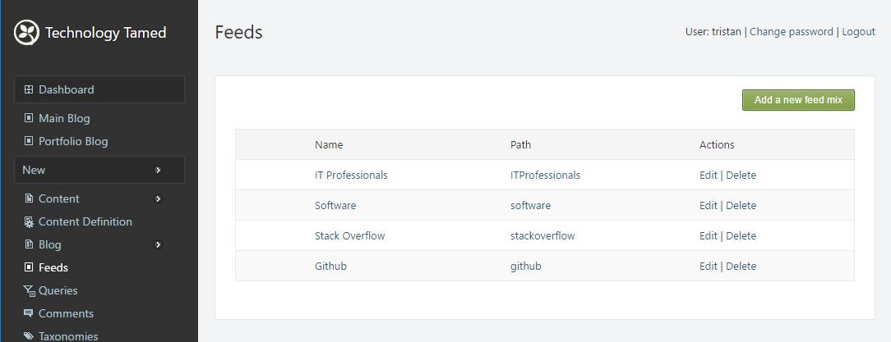

# Feedmix Orchard Module

An Orchard module for aggregating RSS feeds. Currently built against Orchard v.1.10.1

Of course there are lots of free online services that will combine RSS feeds (e.g. [rssmix](http://www.rssmix.com), [ChimpFeedr](http://www.chimpfeedr.com)) however these are mostly "one time only" affairs, where a combined feed can be created but there is no way to subsequently edit that feed to add new feeds or to remove feeds. There are paid services ([RssMixer](https://rssmixer.com/), [FeedInformer](http://feed.informer.com/)) available, but they all place limitations on the number of combined feeds and source feeds.

If you run your own Orchard site and want to take control of your own RSS feed aggregation you may find this module useful.

## How to use:

Enabling the module adds a Feeds menu item on the admin dashboard navigation.

Clicking on the feeds menu item takes the user to the feeds administration screen. Feedmixes can be created, edited and deleted.

Selecting edit feedmix allows the details of the feedmix to be edited and for source feeds to be added, edited or deleted.

Selecting "Add a new feed" allows the user to add a new source feed to the feedmix.

