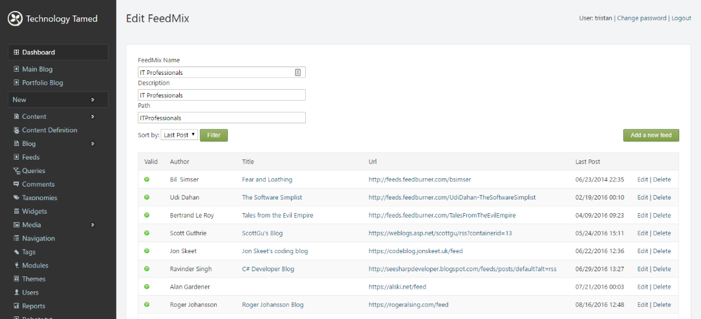

# Feedmix Orchard Module

An Orchard module for aggregating RSS feeds.

## How to use:

Enabling the module adds a Feeds menu item on the admin dashboard navigation.

Clicking on the feeds menu item takes the user to the feeds administration screen. Feedmixes can be created, edited and deleted.

Selecting edit feedmix allows the details of the feedmix to be edited and for source feeds to be added, edited or deleted.

Selecting "Add a new feed" allows the user to add a new source feed to the feedmix.

